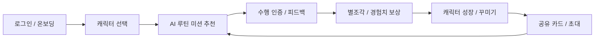
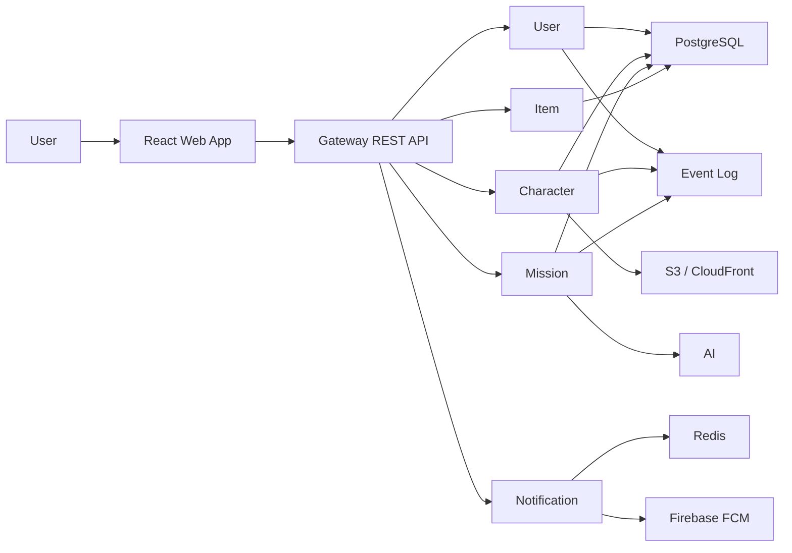

<div align="center">
  <h1>
    
    Polaris
  </h1>
  <p><strong>작은 하루를 별조각으로 바꾸는 AI 캐릭터 루틴 서비스</strong></p>
</div>

<p align="center">
  
  
  
  
  
  
  
  
  
  
</p>

---

## What We Build

Polaris는 사용자가 직접 거창한 목표를 세우지 않아도, 캐릭터와 대화하듯 오늘 할 수 있는 작은 루틴 미션을 받아 수행하는 AI 루틴 서비스입니다.

사용자는 Google OAuth로 로그인한 뒤 별친구 캐릭터를 선택하고, 간단한 온보딩 설문으로 생활 패턴과 선호를 입력합니다. Polaris는 이 정보를 바탕으로 하루에 맞는 미션을 제안하고, 사용자가 미션을 완료하면 캐릭터 경험치와 별조각 보상을 지급합니다. 별조각은 꾸미기 아이템과 스킨을 얻는 데 사용되며, 완성된 캐릭터 카드는 SNS 공유용 이미지로 만들 수 있습니다.

Polaris가 중요하게 보는 것은 체크리스트를 더 많이 만드는 일이 아니라, 작은 행동이 캐릭터의 성장과 사용자 자신의 하루 기록으로 이어지는 경험입니다.

## Product Loop



## Core Features

| Area | Description |
| --- | --- |
| Onboarding | Google OAuth 로그인, 캐릭터 선택, 생활 패턴 기반 개인화 설문 |
| Mission | AI 기반 일일 미션 추천, 거절, 재추천, 완료 인증, 피드백 |
| Character | 만족감, 기운, 안정감 상태 관리와 먹이주기, 씻기, 놀아주기 같은 케어 액션 |
| Growth | 미션 완료와 케어 성공을 통한 캐릭터 경험치, 레벨, 기억 조각 관리 |
| Economy | 별조각 지갑, 보상 지급, 거래 내역, 상점, 인벤토리, 스킨 및 아이템 적용 |
| Share | Canvas 기반 공유 카드 생성, S3 presigned upload, 공개 공유 링크와 OG 미리보기 |
| Notification | 인앱 알림, FCM 푸시, 방해 금지 시간, 미션 및 캐릭터 상태 리마인더 |
| Event Log | 미션, 보상, 공유, 알림 등 주요 행동 이벤트 기록과 추후 분석 기반 |

## Repositories

| Repository | Role |
| --- | --- |
| `polaris` | 실제 운영 중인 백엔드 레포입니다. Spring Boot 기반 멀티 모듈 구조로 gateway, user, character, mission, item, ai, notification, event-log, common, proto 모듈을 관리합니다. |
| `polaris-frontend` | 실제 제품 화면을 구현하는 프론트엔드 레포입니다. React, TypeScript, Vite 기반 `apps/web` 앱과 디자인 시스템, 화면 명세, fixture 모드를 함께 관리합니다. |
| `po-polaris` | 포트폴리오 및 아키텍처 고도화 레포입니다. 운영 서비스의 도메인을 바탕으로 MSA 분리, Kafka 이벤트 흐름, Outbox, SSE, PortOne 결제, k6 부하 검증, Metabase 분석 대시보드까지 확장 실험합니다. |

## Architecture



## Tech Stack

| Layer | Stack |
| --- | --- |
| Frontend | React 18, TypeScript, Vite, React Router, TanStack Query, Zustand, Axios, Firebase, Sentry |
| Backend | Java 21, Spring Boot, Gradle, Nx, gRPC, Protocol Buffers |
| Data | PostgreSQL, Redis, Flyway |
| AI | Gemini 기반 미션/대화 생성, provider fallback, SSE 스트리밍 고도화 실험 |
| Media | S3 presigned URL, CloudFront, Open Graph share preview |
| Notification | Firebase Cloud Messaging, 인앱 알림, 사용자별 알림 설정 |
| Quality | JUnit 5, Testcontainers, JaCoCo, REST Docs, k6, CodeRabbit |
| Infra | Docker, GitHub Actions, AWS 기반 배포 및 운영 자동화 |

## Backend Modules

```text
polaris
├─ gateway        # REST API entrypoint, auth, routing, gRPC client boundary
├─ user           # auth, profile, wallet, star-piece transaction
├─ character      # character state, care action, growth, share card
├─ mission        # mission recommendation, lifecycle, completion, reward
├─ item           # shop, inventory, item catalog, skin application
├─ ai             # AI mission text and character response generation
├─ notification   # in-app notification, FCM token, reminder delivery
├─ event-log      # user behavior and domain event logging
├─ common         # shared response, error, utility contracts
└─ proto          # gRPC and protobuf contracts
```

## Frontend Structure

```text
polaris-frontend
├─ apps/web       # React + TypeScript + Vite product app
├─ assets         # logo, character, item, skin assets
├─ docs           # PRD, API spec, screen spec, design documents
├─ fonts          # font assets and loading guide
├─ preview        # design token and component previews
├─ ui_kits        # early web/mobile prototypes
└─ colors_and_type.css
```

프론트엔드는 기능 단위로 `api/model/ui`를 나누고, 서버 상태는 TanStack Query, 클라이언트 상태는 Zustand로 관리합니다. `VITE_USE_API_FIXTURES` 환경 변수로 실제 API와 fixture 모드를 전환할 수 있어 백엔드 준비 전에도 화면 흐름을 빠르게 검증할 수 있습니다.

## Portfolio Architecture Track

`po-polaris`는 운영 MVP를 더 큰 트래픽과 장애 상황에 견딜 수 있는 구조로 확장하는 포트폴리오 레포입니다.

| Challenge | Approach |
| --- | --- |
| 서비스 경계 분리 | gateway, user, character, mission, item, ai, notification, event-log를 MSA 관점으로 재정리하고 gRPC 계약을 중심에 둡니다. |
| 보상 중복과 이벤트 유실 | Kafka, Outbox Pattern, Idempotency-Key로 미션/공유/결제 보상 흐름의 중복 지급과 유실을 방지합니다. |
| AI 응답 지연 | SSE 기반 스트리밍으로 생성형 응답을 점진적으로 전달하고 사용자 체감 대기 시간을 줄입니다. |
| 결제 안정성 | PortOne 결제 흐름, webhook 검증, DB lock, 멱등성 로직으로 캐시 충전과 구매 흐름을 보호합니다. |
| 운영 검증 | k6 부하 테스트, Testcontainers 통합 테스트, JaCoCo 기준, Metabase 대시보드로 품질과 관측 가능성을 강화합니다. |

## Product Principles

| Principle | Meaning |
| --- | --- |
| Small Wins | 부담 없이 시작할 수 있는 작은 미션을 제안합니다. |
| Character First | 기능보다 캐릭터와의 관계, 성장, 기억을 먼저 설계합니다. |
| Reliable Rewards | 미션, 공유, 출석 보상은 중복 지급과 유실을 방지하는 방향으로 구현합니다. |
| Warm UX | 사용자에게 압박을 주는 생산성 도구보다, 다시 돌아오고 싶은 루틴 경험을 지향합니다. |
| Clear Contracts | API 명세, gRPC proto, 화면 명세, 디자인 토큰을 문서화해 프론트엔드와 백엔드 협업 비용을 줄입니다. |

## Current Focus

- 운영 MVP의 미션 추천, 완료, 보상, 캐릭터 성장 루프 안정화
- 공유 카드 생성, S3 직접 업로드, 공개 공유 링크와 OG 미리보기 신뢰성 개선
- 프론트엔드 실제 API 연동 범위 확대와 fixture 기반 개발 경험 유지
- 알림, 출석, 지갑, 상점, 인벤토리 흐름의 사용자 경험 정돈
- 포트폴리오 레포에서 Kafka, Outbox, SSE, 결제, 부하 테스트 중심의 아키텍처 고도화

## Collaboration

Polaris는 제품 문서, API 명세, 화면 설계, 디자인 시스템, 테스트 전략을 함께 관리하며 기능 단위로 협업합니다. 운영 레포는 실제 사용자 경험을 안정적으로 제공하는 데 집중하고, 포트폴리오 레포는 같은 도메인을 더 큰 아키텍처 문제로 확장해 실험합니다.

우리는 작은 루틴이 사용자에게 부담이 아니라 회복의 단서가 되도록, 제품 경험과 시스템 신뢰성을 함께 다듬고 있습니다.
