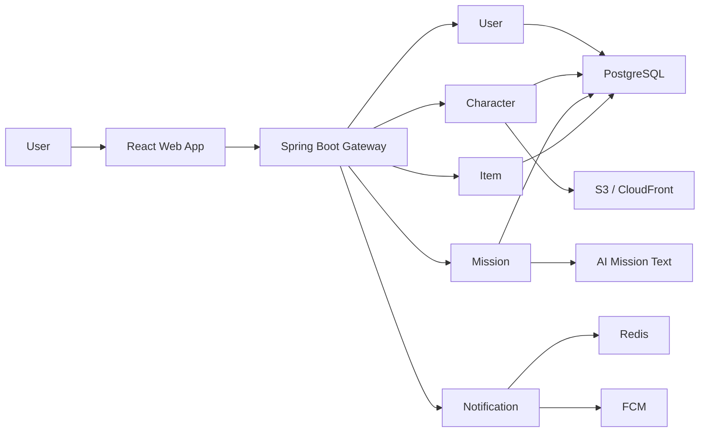

# polaris-traveler

**작은 하루가 별조각이 되고, 별친구가 그걸 기억하는 AI 루틴 서비스**

Polaris는 사용자가 고른 별친구 캐릭터가 먼저 말을 걸고, 사용자의 생활 맥락에 맞는 작은 루틴 미션을 제안하는 AI 다마고치형 서비스입니다. 거창한 목표 관리보다 “오늘도 조금 해냈다”는 감각을 캐릭터, 별조각, 꾸미기, 공유 경험으로 이어갑니다.

## What We Build

Polaris는 아래 흐름을 중심으로 동작합니다.

1. 사용자는 Google OAuth로 로그인하고, 별친구 캐릭터를 선택합니다.
2. 온보딩 설문으로 생활 패턴과 선호를 가볍게 입력합니다.
3. AI와 미션 템플릿을 기반으로 오늘 할 수 있는 작은 미션을 제안합니다.
4. 미션 완료 후 짧은 답변을 남기면 별조각을 획득합니다.
5. 별조각으로 스킨과 소모품을 구매해 캐릭터를 돌봅니다.
6. 공유 카드와 알림을 통해 재방문과 확산을 유도합니다.

## Core Features

| Area | Description |
| --- | --- |
| Onboarding | 캐릭터 선택, 이름 설정, 개인화 설문 |
| Mission | AI 문구 기반 미션 제안, 거절, 완료, 히스토리 |
| Character | 포만감, 기운, 애정 상태와 돌봄 액션 |
| Star Piece | 미션, 출석, 공유 시도 기반 별조각 보상 |
| Shop & Inventory | 스킨, 소모품 구매와 적용 |
| Share | Canvas 기반 공유 카드 생성, S3 업로드, 공개 공유 링크와 OG 미리보기 |
| Notification | 앱 내부 알림과 FCM 기반 재방문 알림 |

## Repositories

| Repository | Role |
| --- | --- |
| `polaris` | Spring Boot 기반 백엔드. gateway, user, character, mission, item, ai, notification, event-log 모듈과 protobuf 공통 계약을 관리합니다. |
| `polaris-frontend` | React, TypeScript, Vite 기반 웹앱. 제품 화면, 디자인 기준, fixture 모드, API 연동, 캐릭터 에셋을 관리합니다. |

## Architecture



## Tech Stack

| Layer | Stack |
| --- | --- |
| Frontend | React 18, TypeScript, Vite, React Router, TanStack Query, Zustand, Axios |
| Backend | Java 21, Spring Boot, Gradle, gRPC, Protocol Buffers |
| Data | PostgreSQL, Redis, Flyway |
| AI | Gemini/GPT provider 연동을 고려한 AI 미션 생성 모듈 |
| Infra | AWS Lightsail, Docker, Nginx/HAProxy, GitHub Actions, DockerHub |
| Media | S3 presigned URL, CloudFront, Open Graph share preview |
| Notification | Firebase Cloud Messaging, 앱 내부 알림 |

## Product Principles

| Principle | Meaning |
| --- | --- |
| Small Wins | 사용자가 부담 없이 시작할 수 있는 작은 미션을 제안합니다. |
| Character First | 기능보다 별친구와의 관계 경험을 앞에 둡니다. |
| Warm UX | 체크리스트 앱처럼 딱딱하지 않고, 다정한 반응과 문구를 유지합니다. |
| MVP Simplicity | 빠른 출시와 검증을 위해 복잡한 분산 구조보다 단순한 모듈형 구조를 우선합니다. |
| Clear Contracts | API 명세, 화면 기준, 디자인 토큰을 문서화해 프론트엔드와 백엔드 협업 비용을 줄입니다. |

## Backend Modules

```text
polaris
├── gateway        # REST API entrypoint
├── user           # auth, profile, wallet
├── character      # character state, care, share card
├── mission        # mission recommendation and completion
├── item           # shop, inventory, item catalog
├── ai             # AI mission text generation
├── notification   # in-app notification and FCM
├── event-log      # event/audit logging
└── proto          # gRPC and protobuf contracts
```

## Frontend Structure

```text
polaris-frontend
├── apps/web       # React + TypeScript + Vite app
├── assets         # logo, character, item images
├── docs           # PRD, API spec, screen/design documents
├── ui_kits        # early web/mobile prototypes
├── preview        # design token and component previews
└── fonts          # font assets and loading guide
```

## Collaboration

Polaris는 제품 문서, API 명세, 화면 설계, 디자인 시스템을 함께 관리하며 기능 단위로 협업합니다. 프론트엔드는 fixture 모드로 백엔드 준비 전에도 화면 흐름을 검증할 수 있고, 백엔드는 모듈별 책임을 나눠 MVP 이후 확장 가능성을 남겨두었습니다.

## Current Focus

현재 Polaris는 MVP 기준으로 핵심 루틴 루프를 완성하는 데 집중하고 있습니다.

- 개인화 온보딩과 캐릭터 선택
- 미션 제안, 거절, 완료, 보상 흐름
- 캐릭터 상태와 아이템 기반 꾸미기
- 공유 카드 생성과 공개 공유 링크
- 출석과 알림 기반 재방문 유도

